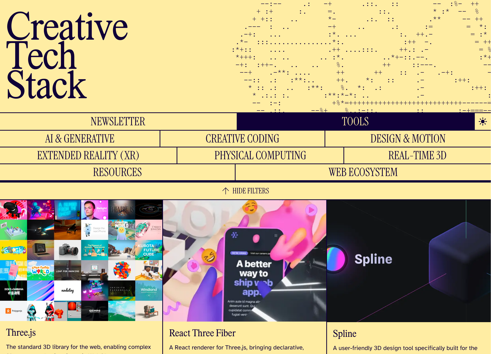

<div align="center">

# Creative Tech Stack

A curated collection of posts and tools for creative coders and technologists.

[](LICENSE)
[](https://nextjs.org)
[](https://www.typescriptlang.org)
[](https://react.dev)
[](https://tailwindcss.com)
[](https://mdxjs.com)




[**Visit live site**](https://creativetechstack.dev/) • [**Browse tools**](https://creativetechstack.dev/tools)

</div>

---

## Contributing

Whether you're just starting out or you've been doing this for years, contributions are welcome. Add a tool, write a post, or improve the codebase.

### Getting started

#### Prerequisites

- Node.js 18+ or pnpm 10+
- Git

#### Installation

```bash
# Clone the repository
git clone https://github.com/jonothanhunt/creative-tech-stack.git
cd creative-tech-stack

# Install dependencies
npm install
# or
pnpm install

# Start the development server
npm run dev
# or
pnpm dev
```

Open [http://localhost:3000](http://localhost:3000) and you're good to go.

---

<details>
<summary><strong>Adding a tool</strong></summary>

Tools live in a TypeScript file. No database needed.

1. Open [`app/data/tools.ts`](https://github.com/jonothanhunt/creative-tech-stack/blob/main/app/data/tools.ts)

2. Add your tool to the `tools` array:

```typescript
{
    "name": "Your Amazing Tool",
    "description": "What it does and why it matters.",
    "image": "/images/tools/your-tool.png", // Add your image to public/images/tools/
    "type": "Tool", // Options: Tool, Library, Platform, Framework, Engine, API, etc.
    "categories": ["Creative Coding", "Real-time 3D"], // Pick from existing categories
    "stacks": ["WebGL", "JavaScript", "3D"], // Add relevant tech tags
    "featured": false, // Set to true if it's exceptional
    "links": [
        {
            "title": "Website",
            "url": "https://yourtool.com"
        },
        {
            "title": "Docs",
            "url": "https://docs.yourtool.com"
        }
    ]
}
```

**Tip:** Check existing tools in [`tools.ts`](https://github.com/jonothanhunt/creative-tech-stack/blob/main/app/data/tools.ts) for reference. Keep descriptions under 150 characters.

3. Add an image (optional but recommended):
   - Place a screenshot or logo in `public/images/tools/`
   - Name it using kebab-case: `your-tool-name.png`
   - Recommended size: 1200x900px (4:3 aspect ratio)

4. Submit a pull request:

```bash
# Fork the repository on GitHub, then clone your fork
git clone https://github.com/YOUR-USERNAME/creative-tech-stack.git
cd creative-tech-stack

# Create a new branch
git checkout -b add-your-tool-name

# Make your changes, then commit
git add .
git commit -m "Add Your Tool Name"

# Push to your fork
git push origin add-your-tool-name
```

Then open a pull request from your fork to the main repository.

</details>

<details>
<summary><strong>Writing a blog post</strong></summary>

Posts are written in MDX (Markdown + React components).

1. Create a new file in `posts/`:

```bash
posts/my-awesome-article.mdx
```

**Tip:** Check out [this example post](https://github.com/jonothanhunt/creative-tech-stack/blob/main/posts/the-state-of-ai-avatars-digital-humans.mdx) to see how it works.

2. Add frontmatter at the top:

```yaml
---
title: "My Awesome Article Title"
date: "2026-01-12"
description: "A compelling summary that appears in previews and SEO."
image: "/images/posts/my-awesome-article/hero.png"
author: "Your Name"
---
```

3. Write your content using Markdown:

```markdown
## Introduction

Your content here...

### Subheading

More insights...
```

4. Use custom components (optional):

```jsx
<YouTubeEmbed url="https://youtube.com/watch?v=..." />

<VimeoEmbed url="https://vimeo.com/..." />

<LinkedInEmbed url="https://linkedin.com/embed/..." />

> 💡 **Pro Tip:** You can also use simple blockquote syntax for info blocks!
```

5. Add images for your post:
   - Create a folder: `public/images/posts/my-awesome-article/`
   - Add your images there
   - Reference them: ``

6. Submit a pull request

**Note:** MDX lets you use React components directly in Markdown. See the [MDX docs](https://mdxjs.com) for more.

<details>
<summary><strong>Advanced: adding new MDX components</strong></summary>

Want to create a new reusable component for posts?

1. Create the component in `components/`:

```tsx
// components/MyCustomComponent.tsx
export default function MyCustomComponent({ children }: { children: React.ReactNode }) {
    return (
        <div className="my-custom-styling">
            {children}
        </div>
    );
}
```

2. Export it from `mdx-components.tsx`:

```tsx
import MyCustomComponent from '@/components/MyCustomComponent';

export function useMDXComponents(components: MDXComponents): MDXComponents {
    return {
        ...components,
        MyCustomComponent,
    };
}
```

3. Use it in any MDX file:

```jsx
<MyCustomComponent>
Your content here
</MyCustomComponent>
```

</details>

</details>

---

## Project structure

```
creative-tech-stack/
├── app/
│   ├── data/
│   │   └── tools.ts          # Tools database
│   ├── tools/                # Tools page
│   ├── newsletter/           # Blog/newsletter pages
│   └── layout.tsx            # Root layout
├── components/               # Reusable React components
│   ├── YouTubeEmbed.tsx
│   ├── VimeoEmbed.tsx
│   ├── InfoBlock.tsx
│   └── ...
├── posts/                    # MDX blog posts
├── public/
│   └── images/
│       ├── tools/            # Tool images
│       └── posts/            # Blog post images
├── lib/                      # Utility functions
└── mdx-components.tsx        # MDX component registry
```

---

## Tech stack

- **Framework:** [Next.js 15](https://nextjs.org) with App Router
- **Language:** [TypeScript 5](https://www.typescriptlang.org)
- **Styling:** [Tailwind CSS 4](https://tailwindcss.com)
- **Content:** [MDX 3](https://mdxjs.com) for blog posts
- **3D Graphics:** [React Three Fiber](https://docs.pmnd.rs/react-three-fiber) + [Three.js](https://threejs.org)
- **Animations:** [Motion](https://motion.dev)
- **Icons:** [React Icons](https://react-icons.github.io/react-icons/)
- **Deployment:** [Vercel](https://vercel.com)

---

## Scripts

```bash
npm run dev          # Start dev server with Turbopack
npm run build        # Build for production
npm run start        # Start production server
npm run lint         # Run ESLint
```

## License

MIT License - see the [LICENSE](LICENSE) file for details.

---

## Get in touch

- **Website:** [creativetechstack.dev](https://creativetechstack.dev)
- **GitHub:** [@jonothanhunt](https://github.com/jonothanhunt)
- **Issues:** [Report a bug or request a feature](https://github.com/jonothanhunt/creative-tech-stack/issues)